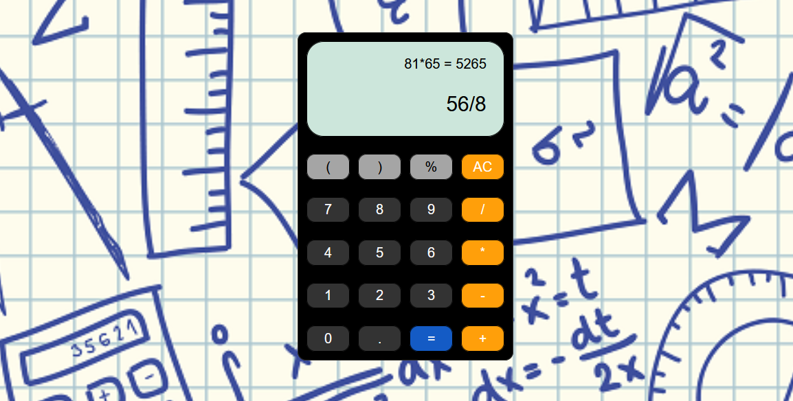

# The calculator

Our first project after leaving the field...  
The project was simple on the surface, **but it wasn't as easy as it looked.**  
The goal was to create a functional calculator.  
We had three days to make it functional.  
## The mission

You can see the statement of the exercise [here](https://github.com/becodeorg/bxl-hopper-1-25/tree/master/The%20Hill/projects/1.calculator).  
This exercise was done during the BeCode web development course.

## The result

  
You can now use it [here]()  

## Colaborators
I've worked with:

- [Guillaume Vanleynseele](https://github.com/G-uillaume)
- [Audrey Gilmant](https://github.com/GAudrey)
- [Madeline Henry](https://github.com/MadelineHenry)
- [Elise Mulumba](https://github.com/elisemlbr)
- [Joelle Everaert](https://github.com/Joelle-Everaert)

